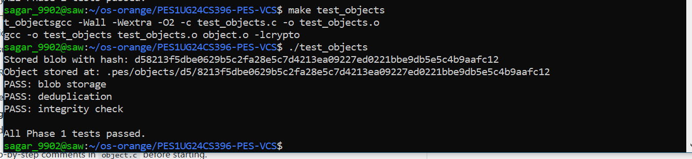
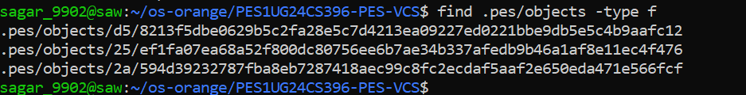
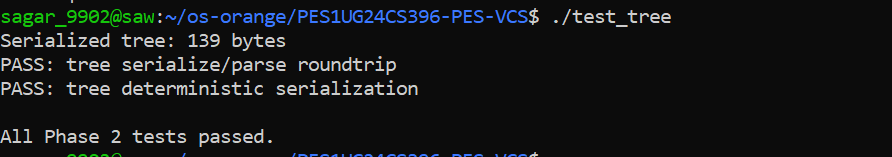
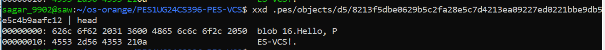
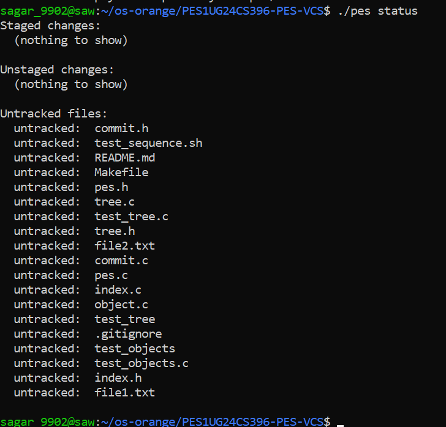
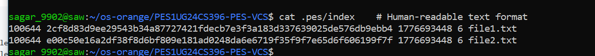
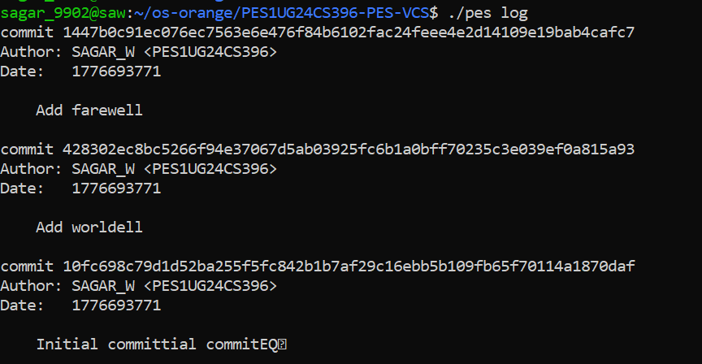
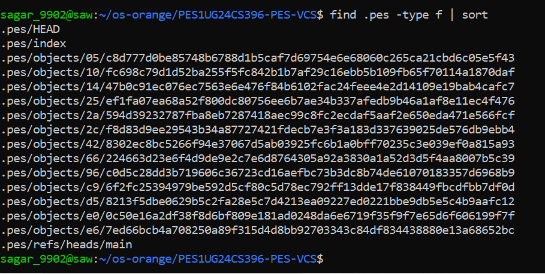
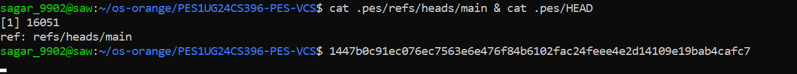

# PES-VCS — OS Lab Final Report

**Name:** Sagar A Walikar  
**SRN:** PES1UG24CS396  
**Course:** Operating Systems - B.Tech CSE  

---

## 1. Screenshots

### Phase 1: Object Storage Foundation
**1A: `./test_objects` output showing all tests passing**  


**1B: `find .pes/objects -type f` showing sharded directory structure**  


### Phase 2: Tree Objects
**2A: `./test_tree` output showing all tests passing**  


**2B: `xxd` of a raw tree object**  


### Phase 3: The Index (Staging Area)
**3A: `pes init` → `pes add` → `pes status` sequence**  


**3B: `cat .pes/index` showing the text-format index**  


### Phase 4: Commits and History
**4A: `pes log` output with three commits**  


**4B: `find .pes -type f | sort` showing object store growth**  


**4C: `cat .pes/refs/heads/main` and `cat .pes/HEAD`**  


### Final Integration Test
**Full integration test (`make test-integration`)**  


---

## 2. Analysis Questions

### Branching and Checkout

**Q5.1: A branch in Git is just a file in `.git/refs/heads/` containing a commit hash... how would you implement `pes checkout <branch>` — what files need to change in `.pes/`, and what must happen to the working directory? What makes this operation complex?**

For implementing `pes checkout <branch>`, the system first needs to read the commit hash stored in `.pes/refs/heads/<branch>`. Then `.pes/HEAD` must be updated to contain `ref: refs/heads/<branch>`. After that, the working directory must be updated to match the snapshot represented by the target commit. This means reading the commit object, getting its root tree, recursively traversing tree objects, and restoring each tracked file from its corresponding blob object.

This operation is complex because checkout is not just a metadata change. It also affects the user's working directory. If tracked files have local modifications, blindly replacing them would cause data loss. So before updating files, the system must compare the current working directory state, the index, and the target branch tree. It must detect conflicts, preserve untracked files safely, and update the index so that it reflects the checked-out branch state.

**Q5.2: When switching branches... If the user has uncommitted changes to a tracked file, and that file differs between branches, checkout must refuse. Describe how you would detect this "dirty working directory" conflict using only the index and the object store.**

To detect this conflict, first use the index entries as the record of the last staged or committed state. For each tracked file, compare the saved `mtime` and `size` from the index with the actual file metadata from `stat()`. If both match, the file is probably unchanged. If either differs, the file may have been modified and needs further verification.

Then compute or compare the current file content hash against the blob hash stored in the index. If the working file hash is different from the index hash, the file is dirty. Next, read the target branch's tree from the object store and find the hash for the same path. If the target branch's blob hash is also different from the current indexed hash, then switching branches would overwrite a modified tracked file. In that case, checkout must stop and report a conflict.

**Q5.3: "Detached HEAD" means HEAD contains a commit hash directly instead of a branch reference. What happens if you make commits in this state? How could a user recover those commits?**

In detached HEAD state, new commits are still created normally, but `HEAD` points directly to a commit hash instead of a branch name. This means the new commit is not attached to any named branch reference in `.pes/refs/heads/`. If the user later switches to another branch, those commits may become unreachable from normal branch history.

The commits are not lost immediately, but they become dangling objects unless a branch or tag is created for them. Recovery is possible if the user still knows the commit hash, or if a reflog-like mechanism exists to track recent `HEAD` positions. The user could recover such commits by creating a new branch that points to the detached commit hash, which restores them into reachable history.

---

### Garbage Collection and Space Reclamation

**Q6.1: Over time, the object store accumulates unreachable objects... Describe an algorithm to find and delete these objects. What data structure would you use to track "reachable" hashes efficiently? For a repository with 100,000 commits and 50 branches, estimate how many objects you'd need to visit.**

A suitable solution is a mark-and-sweep garbage collection algorithm. In the mark phase, start from all references in `.pes/refs/heads/` and anything referenced by `.pes/HEAD`. For each referenced commit, recursively visit its parent commits and its tree. For each tree, recursively visit all child trees and blob hashes. Every visited object hash should be inserted into a hash set so that repeated objects are processed only once.

In the sweep phase, iterate through every stored object file in `.pes/objects/`. If an object's hash is not present in the reachable hash set, it is unreachable and can be deleted. A hash set is the best data structure here because it provides fast membership checks and avoids revisiting shared objects.

For a repository with 100,000 commits and 50 branches, the number of visited objects depends on how much content is shared. In the worst case, GC may visit roughly all reachable commits, trees, and blobs. That could easily be several hundred thousand objects. However, because identical blobs and trees are shared and only visited once, the traversal remains manageable as long as visited hashes are tracked correctly.

**Q6.2: Why is it dangerous to run garbage collection concurrently with a commit operation? Describe a race condition where GC could delete an object that a concurrent commit is about to reference. How does Git's real GC avoid this?**

Running garbage collection during a commit is dangerous because commit creation is a multi-step operation. A blob or tree object may be written into `.pes/objects/` before the final commit object and branch reference are updated. During that short window, the new object exists on disk but is not yet reachable from any branch or from `HEAD`.

A race condition can happen like this: `pes add` or `pes commit` writes a new blob or tree object, but before the commit reference is updated, GC scans the repository and sees that object as unreachable. GC then deletes it. The commit operation continues and writes a commit object that refers to an object that no longer exists, which corrupts the repository state.

Real Git avoids this mainly by using safety mechanisms such as grace periods based on object modification time and by being conservative about deleting very recent unreachable objects. This reduces the chance of removing objects created by an in-progress operation. More advanced implementations also rely on locking and carefully ordered updates so that garbage collection does not interfere with live repository writes.

# Building PES-VCS — A Version Control System from Scratch

**Objective:** Build a local version control system that tracks file changes, stores snapshots efficiently, and supports commit history. Every component maps directly to operating system and filesystem concepts.

**Platform:** Ubuntu 22.04

---

## Getting Started

### Prerequisites

```bash
sudo apt update && sudo apt install -y gcc build-essential libssl-dev
```

### Using This Repository

This is a **template repository**. Do **not** fork it.

1. Click **"Use this template"** → **"Create a new repository"** on GitHub
2. Name your repository (e.g., `SRN-pes-vcs`) and set it to **public**. Replace `SRN` with your actual SRN, e.g., `PESXUG24CSYYY-pes-vcs`
3. Clone this repository to your local machine and do all your lab work inside this directory.
4. **Important:** Remember to commit frequently as you progress. You are required to have a minimum of 5 detailed commits per phase. Refer to [Submission Requirements](#submission-requirements) for more details.
5. Clone your new repository and start working

The repository contains skeleton source files with `// TODO` markers where you need to write code. Functions marked `// PROVIDED` are complete — do not modify them.

### Building

```bash
make          # Build the pes binary
make all      # Build pes + test binaries
make clean    # Remove all build artifacts
```

### Author Configuration

PES-VCS reads the author name from the `PES_AUTHOR` environment variable:

```bash
export PES_AUTHOR="Your Name <PESXUG24CS042>"
```

If unset, it defaults to `"PES User <pes@localhost>"`.

### File Inventory

| File | Role | Your Task |
|------|------|-----------|
| `pes.h` | Core data structures and constants | Do not modify |
| `object.c` | Content-addressable object store | Implement `object_write`, `object_read` |
| `tree.h` | Tree object interface | Do not modify |
| `tree.c` | Tree serialization and construction | Implement `tree_from_index` |
| `index.h` | Staging area interface | Do not modify |
| `index.c` | Staging area (text-based index file) | Implement `index_load`, `index_save`, `index_add` |
| `commit.h` | Commit object interface | Do not modify |
| `commit.c` | Commit creation and history | Implement `commit_create` |
| `pes.c` | CLI entry point and command dispatch | Do not modify |
| `test_objects.c` | Phase 1 test program | Do not modify |
| `test_tree.c` | Phase 2 test program | Do not modify |
| `test_sequence.sh` | End-to-end integration test | Do not modify |
| `Makefile` | Build system | Do not modify |

---

## Understanding Git: What You're Building

Before writing code, understand how Git works under the hood. Git is a content-addressable filesystem with a few clever data structures on top. Everything in this lab is based on Git's real design.

### The Big Picture

When you run `git commit`, Git doesn't store "changes" or "diffs." It stores **complete snapshots** of your entire project. Git uses two tricks to make this efficient:

1. **Content-addressable storage:** Every file is stored by the SHA hash of its contents. Same content = same hash = stored only once.
2. **Tree structures:** Directories are stored as "tree" objects that point to file contents, so unchanged files are just pointers to existing data.

```text
Your project at commit A:          Your project at commit B:
                                   (only README changed)

    root/                              root/
    ├── README.md  ─────┐              ├── README.md  ─────┐
    ├── src/            │              ├── src/            │
    │   └── main.c ─────┼─┐            │   └── main.c ─────┼─┐
    └── Makefile ───────┼─┼─┐          └── Makefile ───────┼─┼─┐
                        │ │ │                              │ │ │
                        ▼ ▼ ▼                              ▼ ▼ ▼
    Object Store:       ┌─────────────────────────────────────────────┐
                        │  a1b2c3 (README v1)    ← only this is new   │
                        │  d4e5f6 (README v2)                         │
                        │  789abc (main.c)       ← shared by both!    │
                        │  fedcba (Makefile)     ← shared by both!    │
                        └─────────────────────────────────────────────┘
```

### The Three Object Types

#### 1. Blob (Binary Large Object)

A blob is just file contents. No filename, no permissions — just the raw bytes.

```text
blob 16\0Hello, World!\n
     ↑    ↑
     │    └── The actual file content
     └─────── Size in bytes
```

The blob is stored at a path determined by its SHA-256 hash. If two files have identical contents, they share one blob.

#### 2. Tree

A tree represents a directory. It's a list of entries, each pointing to a blob (file) or another tree (subdirectory).

```text
100644 blob a1b2c3d4... README.md
100755 blob e5f6a7b8... build.sh
040000 tree 9c0d1e2f... src
       ↑    ↑           ↑
       │    │           └── name
       │    └── hash of the object
       └─────── mode (permissions + type)
```

Mode values:
- `100644` — regular file, not executable
- `100755` — regular file, executable
- `040000` — directory (tree)

#### 3. Commit

A commit ties everything together. It points to a tree (the project snapshot) and contains metadata.

```text
tree 9c0d1e2f3a4b5c6d7e8f9a0b1c2d3e4f5a6b7c8d
parent a1b2c3d4e5f6a7b8c9d0e1f2a3b4c5d6e7f8a9b0
author Alice <alice@example.com> 1699900000
committer Alice <alice@example.com> 1699900000

Add new feature
```

The parent pointer creates a linked list of history:

```text
    C3 ──────► C2 ──────► C1 ──────► (no parent)
    │          │          │
    ▼          ▼          ▼
  Tree3      Tree2      Tree1
```

### How Objects Connect

```text
                    ┌─────────────────────────────────┐
                    │           COMMIT                │
                    │  tree: 7a3f...                  │
                    │  parent: 4b2e...                │
                    │  author: Alice                  │
                    │  message: "Add feature"         │
                    └─────────────┬───────────────────┘
                                  │
                                  ▼
                    ┌─────────────────────────────────┐
                    │         TREE (root)             │
                    │  100644 blob f1a2... README.md  │
                    │  040000 tree 8b3c... src        │
                    │  100644 blob 9d4e... Makefile   │
                    └──────┬──────────┬───────────────┘
                           │          │
              ┌────────────┘          └────────────┐
              ▼                                    ▼
┌─────────────────────────┐          ┌─────────────────────────┐
│      TREE (src)         │          │     BLOB (README.md)    │
│ 100644 blob a5f6 main.c │          │  # My Project           │
└───────────┬─────────────┘          └─────────────────────────┘
            ▼
       ┌────────┐
       │ BLOB   │
       │main.c  │
       └────────┘
```

### References and HEAD

References are files that map human-readable names to commit hashes:

```text
.pes/
├── HEAD
└── refs/
    └── heads/
        └── main
```

**HEAD** points to a branch name. The branch file contains the latest commit hash. When you commit:

1. Git creates the new commit object (pointing to parent)
2. Updates the branch file to contain the new commit's hash
3. HEAD still points to the branch, so it "follows" automatically

```text
Before commit:                    After commit:

HEAD ─► main ─► C2 ─► C1         HEAD ─► main ─► C3 ─► C2 ─► C1
```

### The Index (Staging Area)

The index is the "preparation area" for the next commit. It tracks which files are staged.

```text
Working Directory          Index               Repository (HEAD)
─────────────────         ─────────           ─────────────────
README.md (modified) ──── pes add ──► README.md (staged)
src/main.c                            src/main.c          ──► Last commit's
Makefile                               Makefile                snapshot
```

The workflow:

1. `pes add file.txt` → computes blob hash, stores blob, updates index
2. `pes commit -m "msg"` → builds tree from index, creates commit, updates branch ref

### Content-Addressable Storage

Objects are named by their content's hash:

```python
def store_object(content):
    hash = sha256(content)
    path = f".pes/objects/{hash[0:2]}/{hash[2:]}"
    write_file(path, content)
    return hash
```

This gives us:
- **Deduplication:** Identical files stored once
- **Integrity:** Hash verifies data isn't corrupted
- **Immutability:** Changing content = different hash = different object

Objects are sharded by the first two hex characters to avoid huge directories:

```text
.pes/objects/
├── 2f/
│   └── 8a3b5c7d9e...
├── a1/
│   ├── 9c4e6f8a0b...
│   └── b2d4f6a8c0...
└── ff/
    └── 1234567890...
```

### Exploring a Real Git Repository

You can inspect Git's internals yourself:

```bash
mkdir test-repo && cd test-repo && git init
echo "Hello" > hello.txt
git add hello.txt && git commit -m "First commit"

find .git/objects -type f
git cat-file -t <hash>
git cat-file -p <hash>
cat .git/HEAD
cat .git/refs/heads/main
```

---

## What You'll Build

PES-VCS implements five commands across four phases:

```text
pes init              Create .pes/ repository structure
pes add <file>...     Stage files (hash + update index)
pes status            Show modified/staged/untracked files
pes commit -m <msg>   Create commit from staged files
pes log               Walk and display commit history
```

The `.pes/` directory structure:

```text
my_project/
├── .pes/
│   ├── objects/
│   │   ├── 2f/
│   │   │   └── 8a3b...
│   │   └── a1/
│   │       └── 9c4e...
│   ├── refs/
│   │   └── heads/
│   │       └── main
│   ├── index
│   └── HEAD
└── (working directory files)
```

### Architecture Overview

```text
┌───────────────────────────────────────────────────────────────┐
│                      WORKING DIRECTORY                        │
│                  (actual files you edit)                     │
└───────────────────────────────────────────────────────────────┘
                              │
                        pes add <file>
                              ▼
┌───────────────────────────────────────────────────────────────┐
│                           INDEX                               │
│                (staged changes, ready to commit)              │
│                100644 a1b2c3... src/main.c                    │
└───────────────────────────────────────────────────────────────┘
                              │
                       pes commit -m "msg"
                              ▼
┌───────────────────────────────────────────────────────────────┐
│                       OBJECT STORE                            │
│  ┌───────┐    ┌───────┐    ┌────────┐                         │
│  │ BLOB  │◄───│ TREE  │◄───│ COMMIT │                         │
│  │(file) │    │(dir)  │    │(snap)  │                         │
│  └───────┘    └───────┘    └────────┘                         │
│  Stored at: .pes/objects/XX/YYY...                            │
└───────────────────────────────────────────────────────────────┘
                              │
                              ▼
┌───────────────────────────────────────────────────────────────┐
│                           REFS                                │
│       .pes/refs/heads/main  →  commit hash                    │
│       .pes/HEAD             →  "ref: refs/heads/main"         │
└───────────────────────────────────────────────────────────────┘
```

---

## Phase 1: Object Storage Foundation

**Filesystem Concepts:** Content-addressable storage, directory sharding, atomic writes, hashing for integrity

**Files:** `pes.h` (read), `object.c` (implement `object_write` and `object_read`)

### What to Implement

Open `object.c`. Two functions are marked `// TODO`:

1. **`object_write`** — Stores data in the object store.
   - Prepends a type header (`"blob <size>\0"`, `"tree <size>\0"`, or `"commit <size>\0"`)
   - Computes SHA-256 of the full object (header + data)
   - Writes atomically using the temp-file-then-rename pattern
   - Shards into subdirectories by first 2 hex chars of hash

2. **`object_read`** — Retrieves and verifies data from the object store.
   - Reads the file, parses the header to extract type and size
   - **Verifies integrity** by recomputing the hash and comparing to the filename
   - Returns the data portion (after the `\0`)

Read the detailed step-by-step comments in `object.c` before starting.

### Testing

```bash
make test_objects
./test_objects
```

The test program verifies:
- Blob storage and retrieval (write, read back, compare)
- Deduplication (same content → same hash → stored once)
- Integrity checking (detects corrupted objects)

**📸 Screenshot 1A:** Output of `./test_objects` showing all tests passing.  
**📸 Screenshot 1B:** `find .pes/objects -type f` showing the sharded directory structure.

---

## Phase 2: Tree Objects

**Filesystem Concepts:** Directory representation, recursive structures, file modes and permissions

**Files:** `tree.h` (read), `tree.c` (implement all TODO functions)

### What to Implement

Open `tree.c`. Implement the function marked `// TODO`:

1. **`tree_from_index`** — Builds a tree hierarchy from the index.
   - Handles nested paths: `"src/main.c"` must create a `src` subtree
   - This is what `pes commit` uses to create the snapshot
   - Writes all tree objects to the object store and returns the root hash

### Testing

```bash
make test_tree
./test_tree
```

The test program verifies:
- Serialize → parse roundtrip preserves entries, modes, and hashes
- Deterministic serialization (same entries in any order → identical output)

**📸 Screenshot 2A:** Output of `./test_tree` showing all tests passing.  
**📸 Screenshot 2B:** Pick a tree object from `find .pes/objects -type f` and run `xxd .pes/objects/XX/YYY... | head -20` to show the raw binary format.

---

## Phase 3: The Index (Staging Area)

**Filesystem Concepts:** File format design, atomic writes, change detection using metadata

**Files:** `index.h` (read), `index.c` (implement all TODO functions)

### What to Implement

Open `index.c`. Three functions are marked `// TODO`:

1. **`index_load`** — Reads the text-based `.pes/index` file into an `Index` struct.
   - If the file doesn't exist, initializes an empty index (this is not an error)
   - Parses each line: `<mode> <hash-hex> <mtime> <size> <path>`

2. **`index_save`** — Writes the index atomically (temp file + rename).
   - Sorts entries by path before writing
   - Uses `fsync()` on the temp file before renaming

3. **`index_add`** — Stages a file: reads it, writes blob to object store, updates index entry.
   - Use the provided `index_find` to check for an existing entry

`index_find`, `index_status`, and `index_remove` are already implemented for you — read them to understand the index data structure before starting.

#### Expected Output of `pes status`

```text
Staged changes:
  staged:     hello.txt
  staged:     src/main.c

Unstaged changes:
  modified:   README.md
  deleted:    old_file.txt

Untracked files:
  untracked:  notes.txt
```

If a section has no entries, print the header followed by `(nothing to show)`.

### Testing

```bash
make pes
./pes init
echo "hello" > file1.txt
echo "world" > file2.txt
./pes add file1.txt file2.txt
./pes status
cat .pes/index
```

**📸 Screenshot 3A:** Run `./pes init`, `./pes add file1.txt file2.txt`, `./pes status` — show the output.  
**📸 Screenshot 3B:** `cat .pes/index` showing the text-format index with your entries.

---

## Phase 4: Commits and History

**Filesystem Concepts:** Linked structures on disk, reference files, atomic pointer updates

**Files:** `commit.h` (read), `commit.c` (implement all TODO functions)

### What to Implement

Open `commit.c`. One function is marked `// TODO`:

1. **`commit_create`** — The main commit function:
   - Builds a tree from the index using `tree_from_index()` (**not** from the working directory — commits snapshot the staged state)
   - Reads current HEAD as the parent (may not exist for first commit)
   - Gets the author string from `pes_author()` (defined in `pes.h`)
   - Writes the commit object, then updates HEAD

`commit_parse`, `commit_serialize`, `commit_walk`, `head_read`, and `head_update` are already implemented — read them to understand the commit format before writing `commit_create`.

The commit text format is specified in the comment at the top of `commit.c`.

### Testing

```bash
./pes init
echo "Hello" > hello.txt
./pes add hello.txt
./pes commit -m "Initial commit"

echo "World" >> hello.txt
./pes add hello.txt
./pes commit -m "Add world"

echo "Goodbye" > bye.txt
./pes add bye.txt
./pes commit -m "Add farewell"

./pes log
```

You can also run the full integration test:

```bash
make test-integration
```

**📸 Screenshot 4A:** Output of `./pes log` showing three commits with hashes, authors, timestamps, and messages.  
**📸 Screenshot 4B:** `find .pes -type f | sort` showing object store growth after three commits.  
**📸 Screenshot 4C:** `cat .pes/refs/heads/main` and `cat .pes/HEAD` showing the reference chain.

---

## Phase 5 & 6: Analysis-Only Questions

The following questions cover filesystem concepts beyond the implementation scope of this lab. Answer them in writing — no code required.

### Branching and Checkout

**Q5.1:** A branch in Git is just a file in `.git/refs/heads/` containing a commit hash. Creating a branch is creating a file. Given this, how would you implement `pes checkout <branch>` — what files need to change in `.pes/`, and what must happen to the working directory? What makes this operation complex?

**Q5.2:** When switching branches, the working directory must be updated to match the target branch's tree. If the user has uncommitted changes to a tracked file, and that file differs between branches, checkout must refuse. Describe how you would detect this "dirty working directory" conflict using only the index and the object store.

**Q5.3:** "Detached HEAD" means HEAD contains a commit hash directly instead of a branch reference. What happens if you make commits in this state? How could a user recover those commits?

### Garbage Collection and Space Reclamation

**Q6.1:** Over time, the object store accumulates unreachable objects — blobs, trees, or commits that no branch points to (directly or transitively). Describe an algorithm to find and delete these objects. What data structure would you use to track "reachable" hashes efficiently? For a repository with 100,000 commits and 50 branches, estimate how many objects you'd need to visit.

**Q6.2:** Why is it dangerous to run garbage collection concurrently with a commit operation? Describe a race condition where GC could delete an object that a concurrent commit is about to reference. How does Git's real GC avoid this?

---

## Submission Checklist

### Screenshots Required

| Phase | ID | What to Capture |
|------|----|------------------|
| 1 | 1A | `./test_objects` output showing all tests passing |
| 1 | 1B | `find .pes/objects -type f` showing sharded directory structure |
| 2 | 2A | `./test_tree` output showing all tests passing |
| 2 | 2B | `xxd` of a raw tree object (first 20 lines) |
| 3 | 3A | `pes init` → `pes add` → `pes status` sequence |
| 3 | 3B | `cat .pes/index` showing the text-format index |
| 4 | 4A | `pes log` output with three commits |
| 4 | 4B | `find .pes -type f \| sort` showing object growth |
| 4 | 4C | `cat .pes/refs/heads/main` and `cat .pes/HEAD` |
| Final | -- | Full integration test (`make test-integration`) |

### Code Files Required (5 files)

| File | Description |
|------|-------------|
| `object.c` | Object store implementation |
| `tree.c` | Tree serialization and construction |
| `index.c` | Staging area implementation |
| `commit.c` | Commit creation and history walking |

### Analysis Questions (written answers)

| Section | Questions |
|---------|-----------|
| Branching (analysis-only) | Q5.1, Q5.2, Q5.3 |
| GC (analysis-only) | Q6.1, Q6.2 |

-----------

## Submission Requirements

**1. GitHub Repository**
- You must submit the link to your GitHub repository via the official submission link (which will be shared by your respective faculty).
- The repository must strictly maintain the directory structure you built throughout this lab.
- Ensure your GitHub repository is made `public`.

**2. Lab Report**
- Your report, containing all required **screenshots** and answers to the **analysis questions**, must be placed at the **root** of your repository directory.
- The report must be submitted as either a PDF (`report.pdf`) or a Markdown file (`README.md`).

**3. Commit History (Graded Requirement)**
- **Minimum Requirement:** You must have a minimum of **5 commits per phase** with appropriate commit messages. Submitting fewer than 5 commits for any given phase will result in a deduction of marks.
- **Best Practices:** More than 5 detailed commits per phase is preferred. Granular commits that clearly show step-by-step code changes make it easier to verify understanding and reduce the chance of penalties.

---

## Further Reading

- **Git Internals** (Pro Git book): [https://git-scm.com/book/en/v2/Git-Internals-Plumbing-and-Porcelain](https://git-scm.com/book/en/v2/Git-Internals-Plumbing-and-Porcelain)
- **Git from the inside out**: [https://codewords.recurse.com/issues/two/git-from-the-inside-out](https://codewords.recurse.com/issues/two/git-from-the-inside-out)
- **The Git Parable**: [https://tom.preston-werner.com/2009/05/19/the-git-parable.html](https://tom.preston-werner.com/2009/05/19/the-git-parable.html)